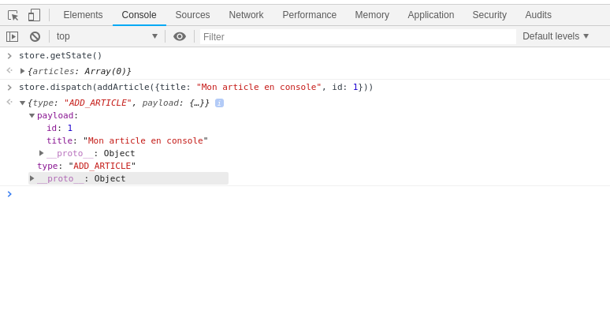

## Exemple 2 ( Utiliser Redux sans React )

Pour installer les dépendances:

### `npm install`

Pour démarrer le projet :

### `npm start`

Par la suite vous pouvez vous amuser dans la console de votre navigateur!! :)

### `|--- Next Step --->`
