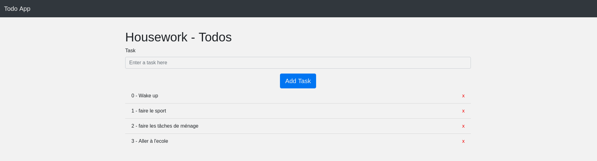

## Exemple 4 ( Faire une Todo très simple )

Pour installer les dépendances:

### `npm install`

Pour démarrer le projet :

### `npm start`

Un jolie exemple Comprendre comment React et Redux communiquent.

### `|--- Next Step --->`

